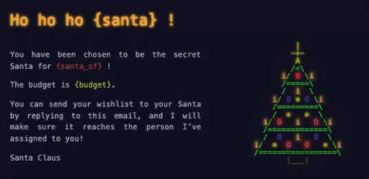

# Automated Secret Santa

A automated Secret Santa in Python — Assign participants and automatically forward wishlists!  

---

## Features

- Automatically assigns Secret Santa pairs (with exclusion rules)
- Sends customized HTML emails to each participant
- Periodically checks your mailbox and forwards participants' wishlists
- Available in English and French

---

## Example: Template of the email sent to participants

<p align="center">
  
</p>

> [!WARNING] 
> This is a capture from Mail (app) on macOS, the rendering may vary depending on the email client.
>
> Email HTML/CSS has limited support across clients and some elements may not render exactly the same. 

---

## Installation

### 1. Clone the repository

```bash
git clone https://github.com/h-escoffier/automated-secret-santa.git
cd automated-secret-santa
```

### 2. Create and activate a virtual environment

```bash
uv venv
source .venv/bin/activate  # On Windows use `.venv\Scripts\activate
```

### 3. Install dependencies

```bash
uv pip install -r requirements.txt
```

### 4. Make the script executable

```bash
chmod +x secret_santa.py
```

---

## Setup 

Automated Secret Santa requires some configuration before use. Please find below the steps to set it up.

### 1. Configure the secret santa email

Add your email configuration in the `data/mail_config.json` file : 

```json
{
  "from_email": "example_email@gmail.com",
  "password": "xxxxxxxxxxxxxxxx"
}
```

> [!TIP] 
> If you use Gmail, you must enable App Passwords and use the generated 16-character token following this [tutorial](https://support.google.com/accounts/answer/185833?hl=en).

### 2. Setup participants

Edit the `participants.csv` file to add your participants and their email addresses:

```csv
name,email
Alice,alice@example.com
Bob,bob@example.com
Charlie,charlie@example.com
```

### 3. _(Optional)_ Configure exclusion rules

If you want to exclude certain participants from being matched with each other, you can edit the `exclusion_rules.csv` file with the following format:

```csv
Alice,Bob
Charlie,Alice
```

Each line corresponds to a group of participants who should be excluded from each other's matches.

---

## Usage 

### 1. Send assignments

```bash
./secret_santa.py send-emails --budget 20€ --language en
```

* `--budget`: Set the maximum gift budget.
* `--language`: Set the language for the emails

### 2. Forward wishlists manually

```bash
./secret_santa.py forward-wishlists --language en
```

* `--language`: Set the language for the emails

### _(Optional)_ Enable automatic wishlist forwarding

```bash
nohup ./secret_santa.py auto-forward --language en &
```

* `--language`: Set the language for the emails

Check if it's running: 
```bash
ps aux | grep "secret_santa.py"
```

Stop it: 
```bash
kill <PID>
```

---

## License

Do whatever, just don't say 'yes' when you should say 'no'. 